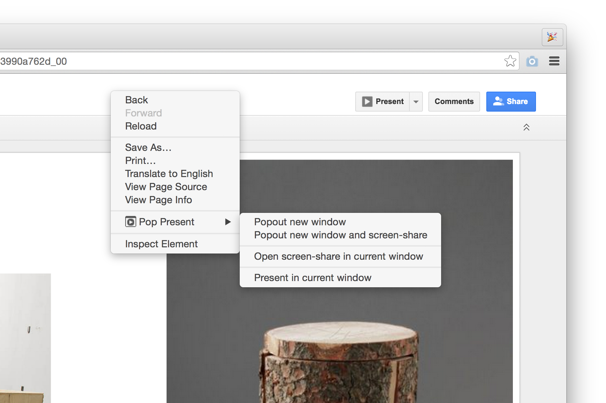

Pop-Present
==============

Contextual menu addition to popout tabs in a new window for easier screen-sharing of sites and [ documents](https://drive.google.com/) in [Google Hangouts](https://plus.google.com/hangouts/_/present/).

[Download Extension](https://github.com/frederickk/pop-present/blob/master/pop-present.crx?raw=true)


Usage
-------------


**Popout new window**
Create a new popup window with the contents of the active tab

**Popout new window and screen-share**
Create a new window with the contents of the active tab along with a tab for [screen-sharing](https://plus.google.com/hangouts/_/present/)

**Open screen-share in current window**
Open a tab for [screen-sharing](https://plus.google.com/hangouts/_/present/) within the active window. If [screen-sharing](https://plus.google.com/hangouts/_/present/) tab is open in another window all (except pinned) tabs of current window will be moved to the window containg the a tab for [screen-sharing](https://plus.google.com/hangouts/_/present/) tab.




If the active tab is a [Google Slides](https://docs.google.com/presentation/) document, an additional menu will be present.

**Present in current window**
Toggles the view of the [Google Slides](https://docs.google.com/presentation/) document to in-browser present mode or...

**Edit in current window**
if the [Google Slides](https://docs.google.com/presentation/) document is currently in present mode, toggle to edit mode.


Installation
-------------

In Chrome, choose Window > Extensions.  Drag ```pop-present.crx``` into the page that appears.

Or, you can also simply load the uncompiled source as follows:


1. Select ```Extensions``` under the ```Tools``` menu or go to [chrome://extensions](chrome://extensions).

2. Ensure that the ```Developer mode``` checkbox in the top right-hand corner is checked.

3. Click ```Load unpacked extension...``` to pop up a file-selection dialog.

4. Navigate to the ```/src``` directory of this repo or drag and drop the ```/src``` directory onto the opened [chrome://extensions](chrome://extensions) tab.


License
-------------
The MIT License (MIT)

Copyright (c) 2014 Ken Frederick

Permission is hereby granted, free of charge, to any person obtaining a copy
of this software and associated documentation files (the "Software"), to deal
in the Software without restriction, including without limitation the rights
to use, copy, modify, merge, publish, distribute, sublicense, and/or sell
copies of the Software, and to permit persons to whom the Software is
furnished to do so, subject to the following conditions:

The above copyright notice and this permission notice shall be included in all
copies or substantial portions of the Software.

THE SOFTWARE IS PROVIDED "AS IS", WITHOUT WARRANTY OF ANY KIND, EXPRESS OR
IMPLIED, INCLUDING BUT NOT LIMITED TO THE WARRANTIES OF MERCHANTABILITY,
FITNESS FOR A PARTICULAR PURPOSE AND NONINFRINGEMENT. IN NO EVENT SHALL THE
AUTHORS OR COPYRIGHT HOLDERS BE LIABLE FOR ANY CLAIM, DAMAGES OR OTHER
LIABILITY, WHETHER IN AN ACTION OF CONTRACT, TORT OR OTHERWISE, ARISING FROM,
OUT OF OR IN CONNECTION WITH THE SOFTWARE OR THE USE OR OTHER DEALINGS IN THE
SOFTWARE.